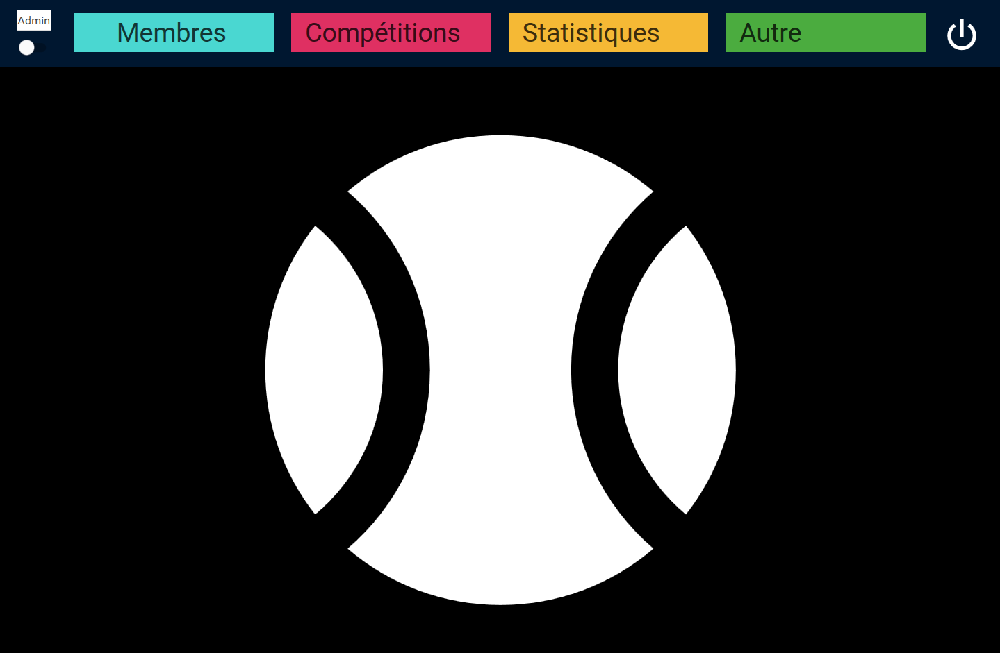
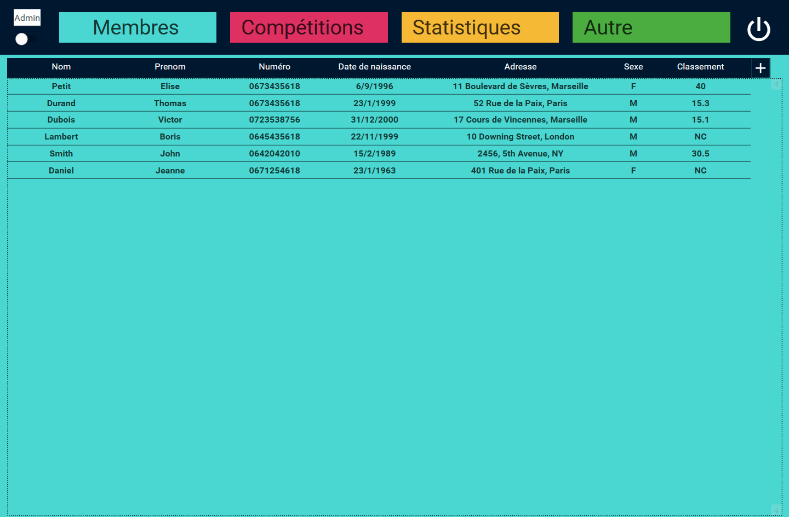
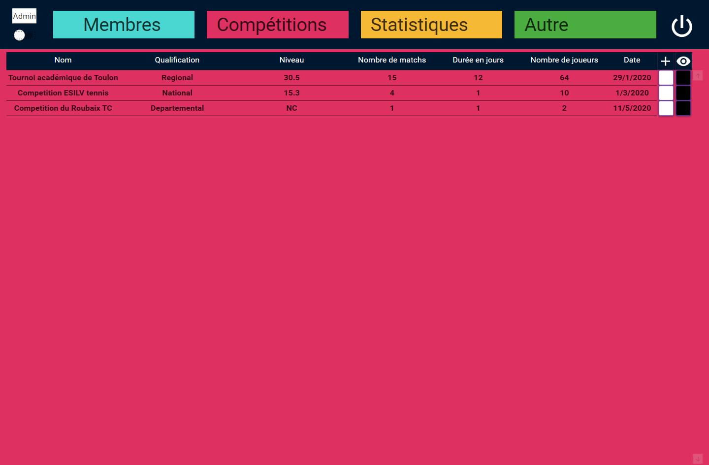
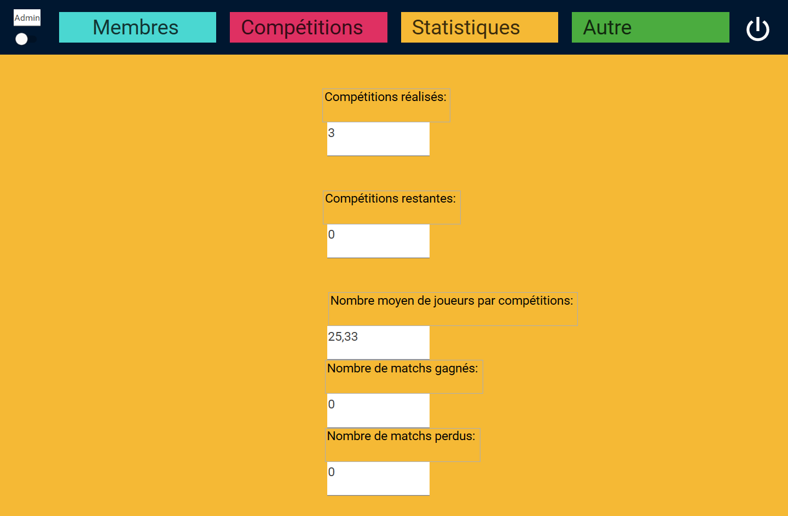
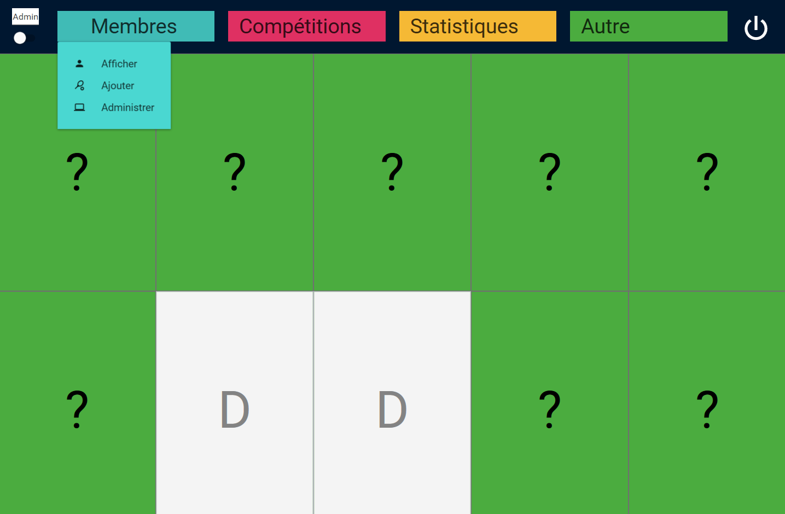

# ESILV_TC
This project is a desktop application made for the management of a tennis club. I used C# and WPF to build this application.

# Landing page

# Members
List of every members of the tennis club

# Tournaments
List of every tournament people from the club can compete in with the option to display the person that are already registered for this tournament

     
# Statistics
Some statistics regarding the tennis club and its members

     
# Memory
A little game to kill the time in between matches and train your memory

